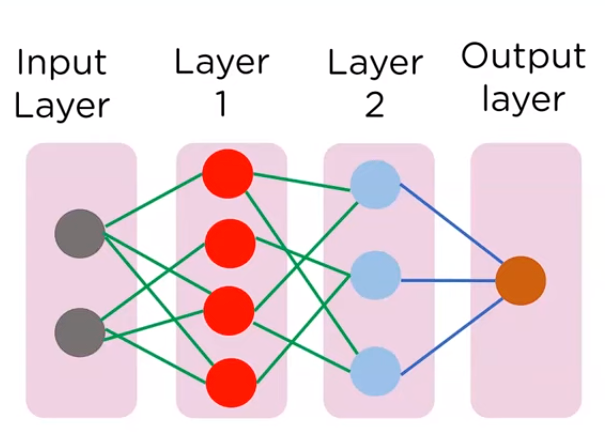
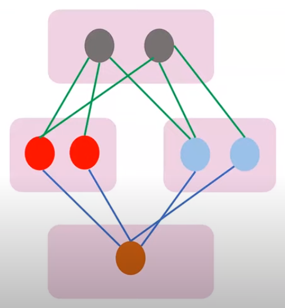
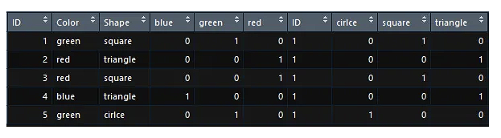

# Machine Learning Annotations
**Luan Alecxander Krzyzaniak**

Applications of machine learning include problems where the decision logic bypass human capability or demand too much work to manually build and mantain.
Some of these problems include face, handwriting or even medical conditions recognition. In these cases, it's difficult for the human mind to identify clear rules or patterns and manually translate them to a algorithm, and that's where machine learning comes in hand. <br>
Of course, it doensn't mean that we can't apply machine learning to more basic problems.

## ✏️ General concepts

**General roadmap for model building**
|ID|Step|Description|
---|---|---|
|1|Dataset|Identify data, study the set, decide on the project bases (oriented/unoriented)|
|2|Pre-processing|Data treatment: remove incomplete or incorrect data, colect statistics, plotting, building relationship tables, normalize data (apply scale)|
|3|Split the data|Prepare training and testing sets|
|4|Choose the algorithm|Define the algorithm (regression or classification) and its hiperparameters|
|5|Test the model|Apply the test set and collect avaliation metrics|
|6|Fix the model|In case of bad performance, we can revisit the hiperparameters, change algorithms or revise our data, identifying bad parameters and experimenting with new ones|

**Training and test sets:** to avoid creating a bias in the pattern recognition, it's important to have a separate set of data for tests. If we test our machines with the same (or part of the) training data, we risk it struggling with different patterns of data in real applications.

**Overfitting:** when your model cannot properly generalize, and become too accustomed to the training dataset. In this case, the accuracy ratings become imprecise, as the model fails when presented with new data.This can happen when your dataset is too small, has a lot of noisy data (irrelevant data), trains for too long with the same dataset, or the model is so complex that the model learn the noisy data. <br>
**Underfitting:** Every model that cannot properly identify what it's supposed to is classified as underfitting.

**Oriented training:** we provide data and expected results to the machine. In this type of training, data quality becomes of upmost importance, given that the performance of the pattern recognition depends on it. <br>
**Unoriented training:** it's used when we cannot determine an expected output, either because we don't know its contents or size. An example include grouping social media users by their media consumption: in this case, we don't know what media categories we're dealing with, so we cannot provide a precise output.

**Regression algorithms:** deals with continuous results, like predicting temperatures or guessing a person's height. <br>
**Classification algorithms:** deals with a specified classification, like classifying a temperature as 'hot' or 'cold' or  even a person as 'short' or 'tall'.

**How to improve a model:**
|ID|Step|Description|
|--|--|--|
|1|More data|Gather as much data as possible, with the best quality possible. Data is our starting point, and having a good foundation will improve the process.|
|2|Treat missing and outlier values|When processing the data, make sure to deal with unusable values, which can compromise the results and impede a series of data plotting and analysing.<br>**Missing values** can be treated by filling them with the mean, median or mode values, building a sub-model for predicting them, or just by ignoring them.<br>**Outliers** can be transformed according to some rule,ignored or outright deleted.|
|3|Feature engineering|We can manipulate the existing data to extract more than the eye can see. This is based on hypotesis, since a good hypotesis dictates how are we going to manipulate the data.|
|3.1|Feature transformation|Here, we normalize the data, applying methods like log, square root or inversing. This can help us visualize the data clearer, and can even deal with some outliers.|
|3.2|Feature creation|Manipulate data according to your hypotesis to generate new types of data. They can correlate with each other, exclude the need of another or even complement existing attributes.|
|4|Feature selection|Find the best attributes and manipulate them. Use only the k-best attributes or prefer manipulate and relate them to each other.|
|5|Algorithms|Choosing the ideal type of algorithm comes with knowledge and intuition. Each one is best suited for a type, treatmetn, quantity and quality of data. Refer to "types of algorithms".|
|6|Algorithm Tuning|It's indispensable to manipulate and find the best algorithm's hyperparamethers for your data. This can lead to a big improvement.|
|7|Ensemble Methods|You can merge the results of multiple weak algorithms to achieve a better result. Methods include bagging and boosting. **[STUDY THIS](https://www.analyticsvidhya.com/blog/2015/08/introduction-ensemble-learning/)**
|8|Cross validation|It's an important concept which prevents overfitting. We should always test the model on data samples we haven't trained it in. **[STUDY THIS](https://www.analyticsvidhya.com/blog/2018/05/improve-model-performance-cross-validation-in-python-r/)**

[The 7 Steps for Machine Learning](https://www.youtube.com/watch?v=nKW8Ndu7Mjw) from Google Cloud Tech

## 💻 Types of algorithms

**GridSearchCV** - an useful tool to find the best algorithm and its hyperparamethers for an individual dataset. **[STUDY THIS](https://scikit-learn.org/stable/modules/generated/sklearn.model_selection.GridSearchCV.html)**

**Select K-best** - An algorithm to select the best attributes. **[STUDY THIS](https://scikit-learn.org/stable/modules/generated/sklearn.feature_selection.SelectKBest.html#sklearn.feature_selection.SelectKBest)**

### K-nearest-neighbors
 - Oriented algorithm.
 - Works by plotting the data and classifying it according to close and already plotted data.
 - Fast, almost instantaneous. 
 - Best used when the classes are well separated, although it is overshadowed by most of other algorithms.

### SVM (Support Vector Machine)
- Oriented algorithm.
- Focus on training and classifying the dataset.
- Each item is plotted in an n-dimensional plane, and the algorithm find an hyperplan that best diferentiate the classes.
- Padding - the distance to the closest item - should be maximized.
- SVM is robust to outliers: in the case that separating perfectly the data is impossible due to outliers, the algorithm chooses to ignore them and build its hyperplan according to the rest.
- Support vectors: the individual observation coordinates.
- Kernel trick: SVM has nucleus functions that are useful for non-linear segregation. They're basically super complex data transformations that discover how to segregate the dataset according to our settings.

|Pros|Cons|
-|-|
|Works well when the data is clearly separated|Bad performance with big datasets, as its training is time-consuming|
|Good when the number of dimensions is bigger than the number of sets|Bad performance for noisy dataset|
|Due to the support vectors, it's memory-efficient||

### Gradient Boosting

- Boosting algorithms are a type of ensemble method where multiple models are created sequentially, each trying to correct the previous one. Ada and Gradient are the most common bosting algorithms.
- Gradient Boosting improves the previous models according to the negative gradient of loss function according to the predictions. Each model tries to minimize it, adding its results to the ensemble until the specified criteria is met. That's an advantage when dealing with ouliers, as they have a weaker impact on the gradient.

## 📘 Introduction for machine learning with python
### Chapter 1

**Why Python?** Python is a general-use language that's easy to use and include a variety of useful features and libraries. It has support for object-oriented programming, web applica tions and GUI design, as well as various libraries for data treatment that allow us to model over any type of data, be it image, text, or value. Also, Python supports some script languages, which allow us to quickly interact with our code via terminal or other tools. <br>

**scikit-learn** is the most used Python library for machine learning. User guide: <https://scikit-learn.org/stable/user_guide.html> <br>
Install it via **ANACONDA**, a prepackage that includes numPy, SciPy, matplotlib, pandas, IPython, Jupyter Notebook, and scikit-learn, or via **PIP** $ pip install numpy scipy matplotlib ipython scikit-learn pandas

## 🟥 Keras

[Keras](https://keras.io) is an native API for [Tensorflow 2](https://www.tensorflow.org) which allows for quick building of neural networks. Keras has abstractions and building blocks that helps quickly building those networks, and is centered around the idea of layers and models.

The main models are: <br>
**Sequential:** The sequential model is the simplest one. It quickly implements layers to a neural network which all the data passes through.



``` python
model = tf.keras.Sequential()
model.add(tf.keras.layers.Dense(30, activation=tf.nn.relu, input_shape(784,)))
model.add(tf.keras.layers.Dense(20, activation=tf.nn.relu))
model.add(tf.keras.layers.Dense(10, activation=tf.nn.softmax))
model.compile( loss='categorical_crossentropy',  
                optimizer='rms prop',
                metrics=['accuracy'])
model.summary()
model.fit(train_features, train_labels, epochs=EPOCHS, batch_size=BATCH_SIZE)
test_loss, test_acc = model.evaluate(test_features, test_labels)
```
*code credit to [Google Cloud Tech](https://www.youtube.com/watch?v=J6Ok8p463C4)*

**Functional model:** this model is able to fork into branches and accepts multi inputs and outputs. It's useful for dealing with similar data that has to be treated differently.

``` python
img_inputs = keras.Input(shape=(32,32,3))
dense = layers.Dense(64, activation="relu")
x = dense(inputs)
x = layers.Dense(64, activation="relu")
(x) outputs = layers.Dense(10)(x)
model = keras.Model(inputs=inputs,
outputs=outputs,
name ="mnist_model")
```



**Layer types:**
- Dense layers
- Convolutional layers
- Pooling layers
- Recurrent layers
- Normalization layers
- etc.


**Activation functions:**
- relu: default activation function
- softmax: categorical distribution function
- etc.

**One-hot encoding:** It's used in Keras to convert values to a matrix, turning each individual value in a column and assigning '1' to the value as index. It's an alternative to
**label encoding**, which usually has poor performance.
``` python
set_labels = tf.keras.utils.to_categorical(set_labels)
```


**Converting a Keras model to a Tensorflow estimator**
``` python
tf_classifier = tf.keras.estimator.model_to_estimator(keras_model=model)
```

**Some tutorials:**<br>
[Getting Started with TensorFlow.js](https://www.youtube.com/watch?v=WYvgP9LfvTg) from Google Cloud Tech <br>
[Getting Started with Keras](https://www.youtube.com/watch?v=J6Ok8p463C4) from Google Cloud Tech<br>
[Scaling up Keras with Estimators](https://www.youtube.com/watch?v=YCXFceVKHTk) from Google Cloud Tech <br>
[Keras Tutorial For Begginers](https://www.youtube.com/watch?v=pWp3PhYI-OU) from Simplilearn


## ⭐ My best tries

|Problem|Algorithm|Accuracy|
-|-|-|
|[Titanic](https://www.kaggle.com/competitions/titanic)|K-Neighbors|7.765|

## ❔ Questions

Gradient: <https://developers.google.com/machine-learning/crash-course/reducing-loss/gradient-descent?hl=pt-br>

Classification report - sklearn

Grid Search CV

getdummies - horizontal classification

https://colab.research.google.com/drive/1-JObByRLB9fYo95-AepOF3XMlNYiMEje?usp=sharing

## 🗒️ References

C. Müller, Andreas; Guido, Sarah. **Introduction to Machine Learning with Python: a guide for data scientists**. First edition. USA: O'Reilly, 2017.

FreeCodeCamp. **Machine Learning Principles Explained**. Available at: <https://www.freecodecamp.org/news/machine-learning-principles-explained/#:~:text=The%20three%20components%20that%20make,to%20look%20at%20your%20data>

AWS Amazon. **What is ovefitting?** Available at: <https://aws.amazon.com/pt/what-is/overfitting/#:~:text=Overfitting%20is%20an%20undesirable%20machine,on%20a%20known%20data%20set>

Analythics Vidhya. **Improve machine learning results**. Available at: <https://www.analyticsvidhya.com/blog/2015/12/improve-machine-learning-results/>.

Addan, Diego. **Support Vector Machine**. Available at:<https://www.inf.ufpr.br/dagoncalves/IA07.pdf>

Vaz, Arthur Lamblet. **One hot encoding, o que é?** Available at: <https://arthurlambletvaz.medium.com/one-hot-encoding-o-que-é-cd2e8d302ae0>
